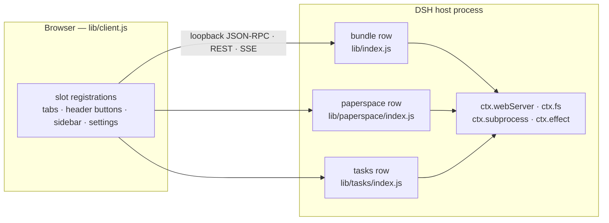

# Development

## Package model

One npm package serves the whole bundle:

- **Host side** — three rows inserted by `cordis.patch.yml`, all pointing at this
  package: the bundle row itself (`dsh-unknownue-plugins`), plus the subpath rows
  `dsh-unknownue-plugins/paperspace` and `dsh-unknownue-plugins/tasks` (the same
  subpath mechanism the official plugins use; see `exports` in `package.json`).
- **Client side** — a single client module, `lib/client.js`, advertised through
  the package's `dsh.client` manifest (`platform: web`, injecting
  `@deepseek-ai/dsh-client-ui-conversation` and `@deepseek-ai/dsh-client-ui-sidebar`).
  DSH discovers it through `require.resolve(<row name> + "/package.json")`, so the
  row `name` must stay the package name — never a subpath.
- **Feature flags** — the client entry wires every surface (`slot` registrations
  for header buttons, the sidebar footer, the three conversation tabs and the
  settings section), so a build without a given DSH slot degrades to an inert
  feature instead of failing.



## Source layout

| Path | Contents |
|---|---|
| `src/host/index.ts` | bundle host row: config resolution, route table, loopback fence |
| `src/host/makefile.ts` | pure Makefile parser **plus** the shared HTTP helpers (`json`, `readBody`, `isLoopback`, `isLoopbackHost`, `messageOf`) |
| `src/host/platform.ts` | open terminal in the host OS (plus `openDirectory`, consumed by the explorer's `reveal` action) |
| `src/host/explorer.ts` | file-explorer host half: routes, structural operations, remote routing, fs.watch hub |
| `src/host/explorer.test.ts` | mock-seam suite for the explorer host half |
| `src/host/paperspace/**` | paperspace host half: routes, settings, schema, domain, worker, runtime |
| `src/host/tasks/**` | task-board host half: routes, store, schema, settings |
| `src/host/types.ts` | locally declared DSH seam types (`ctx.fs`, `ctx.subprocess`, `ctx.webServer`, `ctx.effect`) — minimal honest contracts, no hard `@deepseek-ai/cordis` devDependency |
| `src/client/index.tsx` | client entry: toolbar buttons, tab wiring, shared CSS injection |
| `src/client/toolbar/**` | Makefile panel, width control, open terminal button |
| `src/client/explorer/**`, `src/client/editor/**` | file tree, editor tabs, markdown preview, themes |
| `src/client/explorer-editor/index.ts` | registers the Files tab and mounts the `remote.fileManager` service |
| `src/client/paperspace/**`, `src/client/tasks/**` | the Papers and Tasks tabs, their settings pages and stylesheets |
| `src/client/i18n.ts` | English/Chinese strings for the explorer editor |
| `scripts/verify-sidebar.mjs` | headless harness for the paperspace right-Sidebar wiring (development-only, not published) |

Built artifacts live in `lib/` and **are committed** (`lib/client.js`,
`lib/index.js`, `lib/makefile.js`, `lib/platform.js`, `lib/explorer.js` +
`lib/explorer.test.js`, `lib/paperspace/index.js` +
`lib/paperspace/paperspace.test.js`, `lib/tasks/index.js` +
`lib/tasks/tasks.test.js`). Never edit them by hand; `.gitattributes` pins
`lib/**/*.js` and `src/client/**/*.css` to LF (the `**` covers the nested
paperspace/tasks files) so a build diff stays byte-stable on every platform —
a CRLF checkout would embed CRLF in the bundle and invalidate both the
reproducibility promise and `npm run check:lib`.

Why committed rather than ignored: the package is distributed through git (a
`github:` profile dependency), and `dsh plugin` is a pnpm forwarder that expects
a git-hosted plugin to build itself through a `prepare` script — which pnpm
blocks by default until the package is allowed in the profile's
`pnpm-workspace.yaml`. This package deliberately has **no** `prepare` script
(`main`, `dsh.bundle.patch` and the `dsh.client` bundle all resolve inside
`lib/`), so committing the artifacts keeps the documented one-line install free
of any build step or toolchain requirement in the consuming profile.

The price is that a source change produces a second, generated diff. Stage your
work, then assert that the artifacts you are about to commit are the ones the
sources produce:

```sh
git add -A
npm run check:lib   # rebuild, then fail if `git diff -- lib` is non-empty
```

It is the exact counterpart of a `prepare` build, minus the install-time gate: a
non-empty diff means the rebuilt artifacts are not staged (or were not rebuilt
at all), so commit `lib/` together with the sources that changed it.

## Build pipeline

`esbuild.config.mjs` builds one or both faces:

```sh
npm install          # devDependencies only: esbuild, typescript, @types/{node,react}
npm run build        # client + host
npm run build:client # client only  → lib/client.js
npm run build:host   # host only    → lib/*.js
```

- **Client** — `src/client/index.tsx` is bundled to CJS and wrapped in
  `window.__ModuleLoader__.load({ id, factory })`, the shape DSH's client module
  loader expects; the factory receives `require` and returns `module.exports`.
  React and `react/jsx-runtime` stay external (the host provides them). CSS is
  imported as text; a small plugin scopes paperspace's stylesheet under
  `.dsh-paperspace` and rewrites KaTeX font URLs to
  `/dsh-unknownue-plugins/paperspace/static/fonts/`.
- **Host** — one ESM entry per module, `target: node22`, `packages: "external"`
  (so PGlite's WASM/data assets and postgres.js keep resolving from
  `node_modules`) and `./*.js` external, which keeps the emitted module graph
  identical to hand-written files: `lib/index.js` imports `./makefile.js`,
  `./explorer.js` and `./platform.js` at runtime.

## Typecheck

```sh
npm run typecheck    # tsc --noEmit (client) && tsc -p tsconfig.host.json (host)
```

Two configs: `tsconfig.json` covers `src/client/**` with DOM libs and React JSX;
`tsconfig.host.json` covers `src/host/**` with Node types and `noEmit`.

## Tests

The suites are ad-hoc Node scripts (no test framework) and each one is built
from a `src/host/**/*.test.ts` source file — so **build first**:

```sh
npm run build && npm test
```

`npm test` runs, in order: `lib/explorer.test.js`,
`lib/paperspace/paperspace.test.js`, `lib/tasks/tasks.test.js`. What each suite
covers is documented with the feature: [File explorer](features/file-explorer.md#tests),
[Paperspace](features/paperspace.md#tests), [Tasks](features/tasks.md#tests).

### Verification harness

- `scripts/verify-sidebar.mjs` — a headless harness for the paperspace
  right-Sidebar wiring, which no `tsc` pass can check: it materializes the built
  client bundle the way DSH does, runs `apply(ctx)` against a recording stub
  context, asserts the navigation contract in both directions (params → route,
  navigate → params), and drives the controller facade behind the "open in
  sidebar" action. It borrows `react`/`react-dom` from an installed profile
  (`DSH_PROFILE` overrides the default `~/.dsh/profiles/web/package.json`) and
  must be run from the repository root, because it resolves the built bundle and
  the package manifest relative to `process.cwd()`.

  ```sh
  npm run build
  npm run verify:sidebar      # same as: node scripts/verify-sidebar.mjs
  ```

  Re-run it after a DSH upgrade: it is the cheapest way to learn that the right
  Sidebar's service names, slot keys or tab-type contract moved.
- One-off probes do not belong in the repository: keep them in `spike/`, which is
  gitignored (it also holds the pglite experiments). Probes that import
  TypeScript sources directly need the engine's type-stripping Node runtime
  (`node >= 22.19`), and they must resolve their own sample inputs — never a path
  inside a live paperspace data directory.

## Adding a feature

1. **Host half** — add `src/host/<feature>.ts` exporting pure helpers plus a
   `<feature>Dispatch(method, params)` function (the Makefile module is the
   smallest example). Register its route in `src/host/index.ts` through the
   shared `registerRoute` helper so it inherits the loopback fence, the `POST`
   check, the bounded JSON body and the `{ ok, value | error }` envelope.
2. **Browser half** (optional) — add components under `src/client/<feature>/`
   and wire them into `src/client/index.tsx` (or into the tab registration that
   owns them). Register slots inside `ctx.effect(...)` so disposal is automatic.
3. **Config** — add defaults to the `config:` block of the matching row in
   `cordis.patch.yml`; document them in
   [Configuration](reference/configuration.md).
4. **Rebuild and install** — `npm run build`, then re-run
   `dsh plugin --profile web install` and restart `dsh web`. Commit the rebuilt
   `lib/` artifacts together with the sources.

## Install and upgrade workflow

```sh
dsh plugin --profile web add github:unknownue/dsh-unknownue-plugins
dsh plugin --profile web install
dsh web                     # restart, then refresh the browser page
```

> **First install with DSH's supply-chain pnpm**: native build scripts are
> blocked by default — allow them once per profile by listing the package names
> under `onlyBuiltDependencies` in the profile's `pnpm-workspace.yaml` (the key
> pnpm 10 reads; the DSH CLI hint calls it `allowBuilds`): `ssh2`,
> `cpu-features`, `koffi`, `node-pty`, `dsh-subprocess-local` — then run
> `dsh plugin --profile web install`.

A development setup usually links a local checkout instead
(`dsh plugin --profile web add <path>`, or a `link:` entry in the profile's
`package.json`), which is what this workspace does for this package and its
companion [integrations](integrations.md).

## Packaging

`package.json` → `files` ships `lib`, `src/client`, `src/host`,
`cordis.patch.yml`, `README.md`, `docs` and `THIRD-PARTY-NOTICES.md`; the
`dsh.bundle.patch` field points at `cordis.patch.yml`, which is what makes the
package mountable as a bundle. Everything else — `scripts/`, `src/host/**/*.test.ts`,
the build config and the two `tsconfig` files — is development-only and stays out
of the published tarball. Third-party attribution required by the bundled
dependencies is listed in `THIRD-PARTY-NOTICES.md`.
